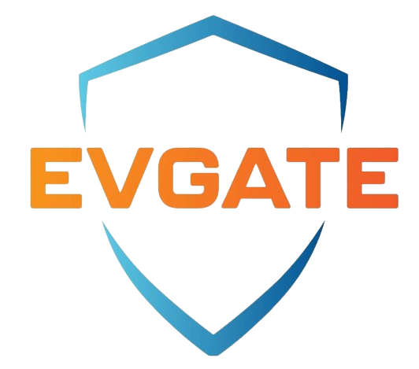

# Firmware Public Stroomer

## Logo

<p align="center">
  
  
  
  
</p>

Repository ini digunakan untuk distribusi **firmware public** buatan **Stroomer**.
Fokus repo ini adalah penyimpanan firmware final yang siap dibagikan, bukan source code, bukan file kerja internal, dan bukan arsip development.

## Tujuan Repo

- Menjadi tempat upload firmware release yang sudah final dan siap digunakan.
- Menjaga struktur file tetap rapi, konsisten, dan mudah dicari.
- Menghindari upload file yang tidak perlu ke repo public.

## Aturan Umum

- Gunakan nama folder yang jelas, singkat, dan konsisten.
- Pisahkan firmware berdasarkan **produk**, lalu **status**: `testing` atau `release`.
- Simpan file firmware hanya di folder status yang sesuai.
- Utamakan upload file `.bin` yang memang diperlukan untuk distribusi firmware.
- Hindari nama file/folder seperti `baru`, `fix`, `final`, `final-baru`, `test`, `backup`, `coba`, atau nama lain yang ambigu.
- Jangan upload file yang bersifat rahasia, internal, atau belum final.

## File Yang Boleh Di-upload

Utamakan hanya file berikut:

- `*.bin` untuk firmware final.
- `README.md` atau file catatan singkat jika memang perlu menjelaskan isi release.
- File pendukung publik lain hanya jika benar-benar dibutuhkan, misalnya checksum atau release note singkat.

## File Yang Tidak Boleh Di-upload

Jangan upload file berikut ke repo ini:

- Source code firmware.
- File project IDE atau build system.
- File temporary atau cache.
- File hasil test internal.
- File debug.
- File backup.
- Screenshot yang tidak relevan.
- Dokumen internal perusahaan.
- Credential, token, password, license key, atau data sensitif apa pun.
- File selain artefak release final, kecuali memang ada kebutuhan publik yang jelas.

## Struktur Folder Yang Disarankan

Gunakan struktur seperti ini:

```text
<produk>/
  testing/
    <nama-file-firmware>.bin
  release/
    <nama-file-firmware>.bin
```

Contoh:

```text
teletoken/
  testing/
    stroomer-teletoken-v1.4.2.bin
  release/
    stroomer-teletoken-v1.4.2.bin

spklu/
  testing/
    stroomer-spklu-v1.0.0.bin
  release/
    stroomer-spklu-v1.0.0.bin

charger-get/
  testing/
    stroomer-charger-get-v2.1.3.bin
  release/
    stroomer-charger-get-v2.1.3.bin
```

## Aturan Nama Folder

### 1. Nama folder produk

Gunakan nama produk atau keluarga device yang jelas, misalnya:

- `spklu`
- `charger-get`
- `teletoken`

Aturan:

- Gunakan huruf kecil semua.
- Gunakan tanda hubung `-` jika perlu.
- Jangan gunakan spasi.
- Jangan gunakan nama internal yang tidak dikenal publik, kecuali memang itu nama resmi produk.

### 2. Nama folder status

Gunakan nama folder status yang tetap dan tidak berubah-ubah:

- `testing`
- `release`

Arti penggunaan:

- `testing` untuk firmware uji coba, validasi, atau pengecekan internal/terbatas.
- `release` untuk firmware final yang resmi dibagikan.

Hindari:

- `baru`
- `final`
- `fix`
- `revisi`
- `update-akhir`
- `test-baru`

## Aturan Nama File Firmware

Gunakan nama file yang langsung menjelaskan isi file.

Format yang disarankan:

```text
stroomer-<produk>-<versi>.bin
```

Contoh:

- `stroomer-spklu-v1.0.0.bin`
- `stroomer-charger-get-v2.1.3.bin`
- `stroomer-teletoken-v1.4.2.bin`

Jika perlu membedakan varian hardware, tambahkan di nama file:

```text
stroomer-<produk>-<varian>-<versi>.bin
```

Contoh:

- `stroomer-spklu-esp32-v1.0.0.bin`
- `stroomer-teletoken-revA-v1.4.2.bin`

## SOP Upload Firmware

Ikuti langkah berikut setiap kali menambahkan firmware baru:

1. Pastikan firmware memang masuk kategori `testing` atau `release`.
2. Tentukan folder produk yang sesuai.
3. Simpan file ke folder status yang benar: `testing/` atau `release/`.
4. Upload hanya file firmware final yang diperlukan, utamanya file `.bin`.
5. Gunakan nama file yang jelas dan mengikuti format repo.
6. Pastikan tidak ada file internal, source code, atau file sampah ikut ter-upload.
7. Jika firmware sudah resmi, pindahkan atau upload salinan yang sesuai ke folder `release/`.

## Checklist Sebelum Upload

Sebelum push ke repo public, cek hal berikut:

- Nama folder produk sudah benar.
- Nama folder status sudah konsisten.
- Nama file firmware sudah jelas.
- File yang di-upload hanya artefak release final.
- Tidak ada file rahasia atau internal.
- Tidak ada file duplikat, backup, atau file percobaan.
- Firmware yang di-upload memang sesuai statusnya: `testing` atau `release`.

## Prinsip Repo Ini

Repo ini harus tetap:

- Rapi
- Mudah dicari
- Konsisten
- Aman untuk publik
- Hanya berisi firmware public resmi Stroomer

Kalau ragu sebuah file boleh di-upload atau tidak, anggap **tidak boleh** sampai jelas bahwa file tersebut memang aman dan memang ditujukan untuk publik.
